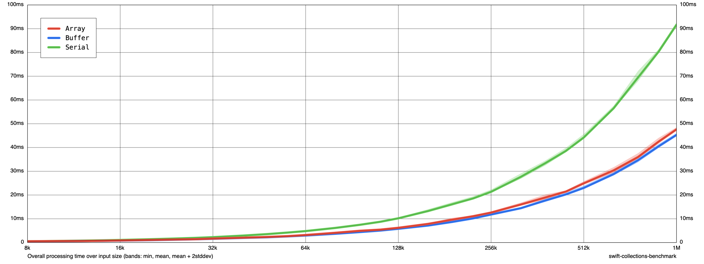

# Benchmarking Parallelized Subarray Sorting

## Introduction

Note, this is in response to the Stack Overflow question [Concurrently access non-overlapping subranges of Array in Swift](https://stackoverflow.com/a/77632214/1271826). This is not an actual sort algorithm (it is just sorting individual non-overlapping array slices), but is more of a proof of concept for the use of the [Swift Collections Benchmark](https://github.com/apple/swift-collections-benchmark) tool.

The process of building this project was as follows:

 * create a new macOS command line app;
 * added the [`Package.swift`](Package.swift);
 * renamed the folder with `main.swift` to be `Sources`; and
 * updated [`main.swift`](Sources/main.swift) to perform a few benchmarks:

    ```swift
    import CollectionsBenchmark

    var benchmark = Benchmark(title: "Array/Buffer Benchmark")

    let experiment = SubarraySorts()

    benchmark.addSimple(title: "Array", input: Int.self) { input in
        blackHole(experiment.synchronousArrayExperiment(input))
    }

    benchmark.addSimple(title: "Buffer", input: Int.self) { input in
        blackHole(experiment.synchronousBufferExperiment(input))
    }

    benchmark.addSimple(title: "Serial", input: Int.self) { input in
        blackHole(experiment.serialExperiment(input))
    }

    benchmark.main()
    ```

- - -

## Benchmarking

To benchmark from the command line:

```none
swift run -c release benchmark run results --cycles 5 --mode replace --max-size 1m --min-size 8k
```

To generate chart:

```none
swift run -c release benchmark render results chart.png --amortized false --linear-time
```

That results in:



- - -

## Command line help

To generate `run` help from the command line:

```none
swift run -c release benchmark run --help
```

To generate `render` help:

```none
swift run -c release benchmark render --help
```

- - -

## Build configuration

Built in Xcode 15.0.1 and Swift 5.9.

- - -

## License

12 December 2023

Copyright © 2023 Robert M. Ryan. All Rights Reserved.

See [License](LICENSE.md).
